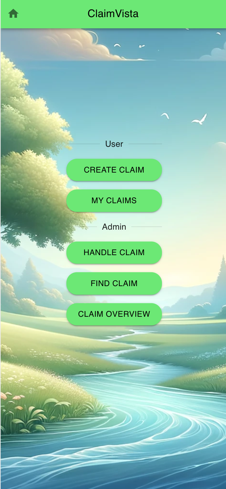

# Claims Management System


This Claims Management System is a React-based application designed to streamline the process of creating, managing, and finding insurance claims. It utilizes Material-UI for a polished, user-friendly interface and includes features such as claim creation, search functionality, and a detailed view of claims with similar cases and cost estimates.

## Features

- **Home View**: Initial landing page that directs users to different parts of the application.
- **Create Claim View**: Allows users to submit new claims with relevant details.
- **Manage Claim View**: Lists unhandled claims and provides an interface for claim management.
- **Find Claim View**: Offers a search functionality to locate claims based on specific criteria.
- **Similar Claims Analysis**: Upon selecting a claim, the system fetches and displays similar claims, including an average cost estimate to aid in evaluation.

## Prerequistes

1. Created a new MongoDB Atlas project for your Claim Vista app
2. Created a new cluster inside that project for Claim Vista data that is running
3. Created an API Key inside that project, and recorded the public and private api keys,for more information see https://www.mongodb.com/docs/atlas/configure-api-access/#create-an-api-key-for-a-project
4. Installed node and atlas-app-services-cli   ```npm install -g atlas-app-services-cli```

## Setup and Installation

Ensure you have [Node.js](https://nodejs.org/) installed on your system to run this project.

1. Clone the repository:
   ```
   git clone <repository-url>
   ```

2. Navigate to the project directory, in the root of the clone directory:
   ```
   cd frontend
   ```
3. Update env.var:

   ```
   ATLAS_CLUSTER_NAME=demo-cluster
   ATLAS_PUBLIC_API_KEY=wancyeds
   ATLAS_PRIVATE_API_KEY=db235axa-xdyd-3543-b534-19fe60e755ef
   ATLAS_PROJECT_ID=5f49dca27a4f7e35487f7e0c
   APPLICATION_NAME=claimvista
   REALM_CLIENT_APP_ID=
   ```

4. Create Application for ClaimVista in Atlas AppServices:
   ```
   ./setup.sh
   ```
5. Import src/claimvista.charts the claim vista charts, using the import function in Atlas Charts. You will need to connect configure the datasource. Once imported you will need to get the chart

6.  Update the API_BASE_URL and CHART_BASE_URL, you can retrieve this from the Atlas UI, and select embedd.  Below an example of src/config.js

   ```
      const config = {
         API_BASE_URL: "https://data.mongodb-api.com/app/claimvista-nnmqw/endpoint",
         CHART_BASE_URL: "https://charts.mongodb.com/charts-claimvista-dev-mvitw",
         CHART_ID: "65edc480-1171-4a62-8a05-b66082c54b62",
         CHART_ID1: "65edc480-1171-4358-8486-b66082c54b5c",
         CHART_ID2: "65edc480-1171-430e-8086-b66082c54b6a",
      };
   ```

7. Before deploying you must enable hosting using the Atlas UI. For more information see:  https://www.mongodb.com/docs/atlas/app-services/hosting/host-a-single-page-application/#procedure


8. Deploy application:
   ```
      ./deploy.sh
   ```

You can find the URL to the application by looking in App Services for the created application:
You can now access the application from the endpoint described, in hosting/config.json   

Example below:
```
"app_default_domain": "lotr-alugj.mongodbstitch.com"
```
9. Create a Claim, and then
## Usage

- **Navigating the Application**: Use the navigation bar at the top to switch between different views.
- **Creating a Claim**: Navigate to the Create Claim view and fill out the form to submit a new claim.
- **Managing Claims**: The Manage Claim view lists all unhandled claims. Click on a claim to view details, similar cases, and suggested cost estimates.
- **Finding Claims**: Use the search bar in the Find Claim view to search for claims. The system will display matching results below the search bar.

## Contributing

Contributions to improve the Claims Management System are welcome. Please feel free to fork the repository, make changes, and submit pull requests.

## License

This project is licensed under the MIT License - see the LICENSE.md file for details.


